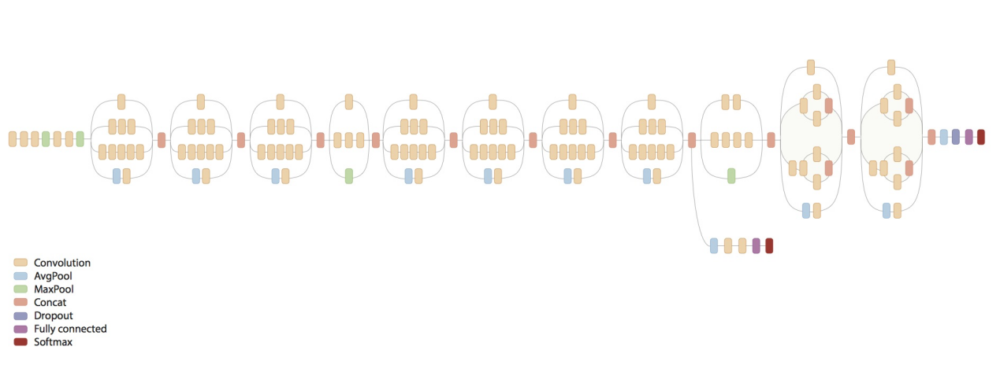

| 左对齐 | 右对齐 | 居中对齐 |
| :-----| ----: | :----: |
| 单元格 | 单元格 | 单元格 |
| 单元格 | 单元格 | 单元格 |


```flow
st=>start: 开始
op=>operation: My Operation
cond=>condition: Yes or No?
e=>end
st->op->cond
cond(yes)->e
cond(no)->op
```

$a+b=c$

$$
\overbrace{0,0,\dots,0}^{\text{共n项}}
$$

$$
{f(x)=a_nx^n+a_{n-1}x^{n-1}+a_{n-2}x^{n-2}}+\cdots \tag{1.1}
$$

$$
A=
\left\{
 \begin{matrix}
   a & b & \cdots & e\\
   f & g & \cdots & j \\
   \vdots & \vdots & \ddots & \vdots \\
   p & q & \cdots & t
  \end{matrix} 
\right\}
$$

$$
\begin{array}{c}
F_{n+2}=F_{n+1}+F_{n} \\ 
F_{n+1}=F_{n+1}
\end{array}
$$

$$
\left[
\begin{array}{cc|c}
1 & 2 & 3 \\
4 & 5 & 6
\end{array}
\right] 
$$


# 1. 安装
## 1.1. 安装依赖项
### Ubuntu/Linux 64-bit
```
$ sudo apt-get update
$ sudo apt-get install -y build-essential curl libcurl3-dev git libfreetype6-dev libpng12-dev libzmq3-dev pkg-config python-dev python-pip software-properties-common swig zip zlib1g-dev libcupti-dev
$ sudo pip install numpy wheel
```
### CentOS/Linux 64-bit
```
$ yum upgrade
$ yum install -y gcc gcc-c++ make openssl-devel kernel-devel kernel-doc kernel-headers curl git freetype-devel libpng-devel pkgconfig python-devel python-pip swig zip zlib-devel epel-release dkms
```
以下这步保证kernel-devel与内核版本保持一致
```
$ yum -y install "kernel-devel-uname-r == $(uname -r)" 
```

# 12. Inception详解
网络模型


## 12.1. slim/scopes.py
若一个代码块内多次调用的某一函数，如ops.conv2d()，则将其声明在scopes.arg_scope内，并设定ops.conv2d()的默认部分参数，在代码块内调用ops.conv2d()并传入参数时，参数列表即会补充arg_scope参数列表内的参数，如果调用时传入参数与arg_scope参数列表中存在重复，传入参数会覆盖arg_scope参数。
下面为示例：
```
with scopes.arg_scope(ops.conv2d, padding='SAME', stddev=0.01, weight_decay=0.0005):
    net = ops.conv2d(inputs, 64, [11, 11], 4, padding='VALID', scope='conv1')
net = ops.conv2d(net, 256, [5, 5], scope='conv2')
```
实际执行为：
```
ops.conv2d(inputs, 64, [11, 11], 4, padding='VALID', stddev=0.01, weight_decay=0.0005, scope='conv1')
```
与
```
ops.conv2d(inputs, 256, [5, 5], padding='SAME', stddev=0.01, weight_decay=0.0005, scope='conv2')
```
## 12.2. slim/losses.py
正则函数regularizer，有利于防止过拟合，提高泛化能力
l1_regularizer, l1正则化，在原始的代价函数后面加上，所有权重w的绝对值的和乘以λ/n
$$
c = c_0 + \frac{\lambda}{n}\sum_{w}{{w}}
$$
l2_regularizer, L2正则化就是在代价函数后面再加上一个正则化项：
$$
c = c_0 + \lambda 
$$
$c_0$代表原始的代价函数，后面那一项就是$L_{2}$正则化项，它是这样来的：所有参数w的平方的和，除以训练集的样本大小n。λ就是正则项系数，权衡正则项与C0项的比重。另外还有一个系数1/2，1/2经常会看到，主要是为了后面求导的结果方便，后面那一项求导会产生一个2，与1/2相乘刚好凑整。
实际上tensorflow已有l2正则化函数tf.nn.l2_loss
l1_l2_regularizer，l1l2正则函数
同时添加l1正则项和l2正则项
l1损失函数和l2损失函数同l1,l2正则化，并将损失值加入共享集合中
cross_entropy_loss，交叉熵函数，调用函数tf.nn.
```
softmax_cross_entropy_with_logits(logits, labels, dim=-1, name=None)
```

$$
x= \begin{bmatrix} x_{1} \\ x_{2} \\ \vdots \\ x_{m} \end{bmatrix}
$$